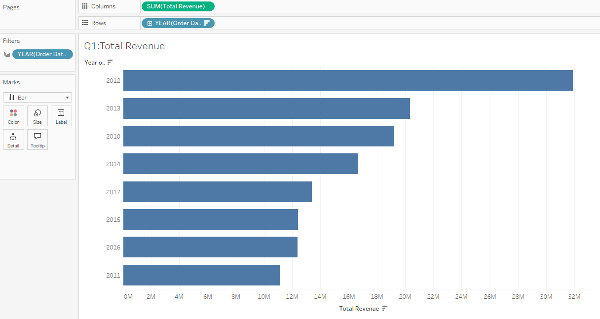
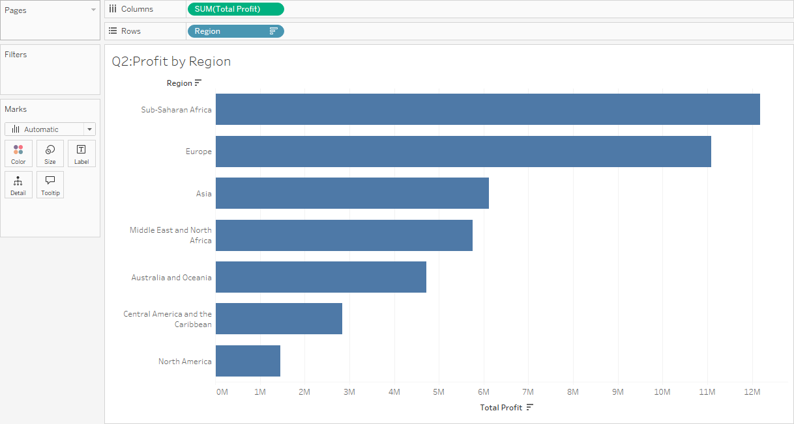
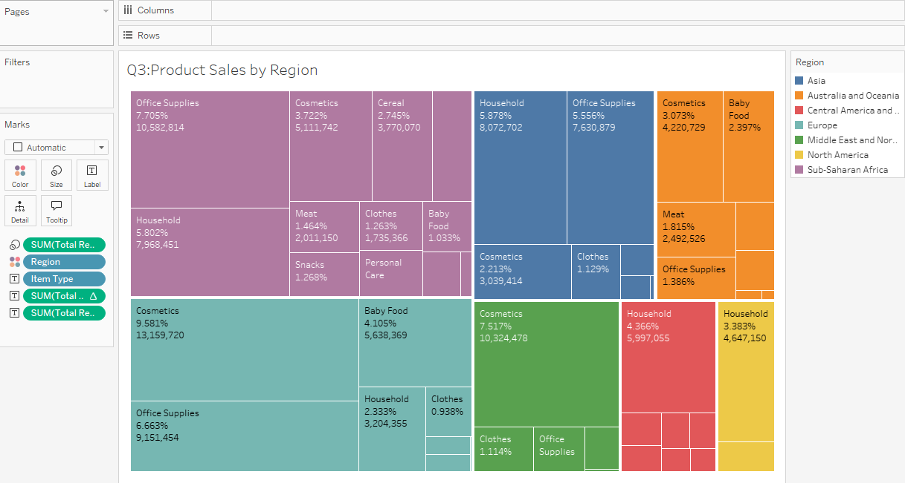
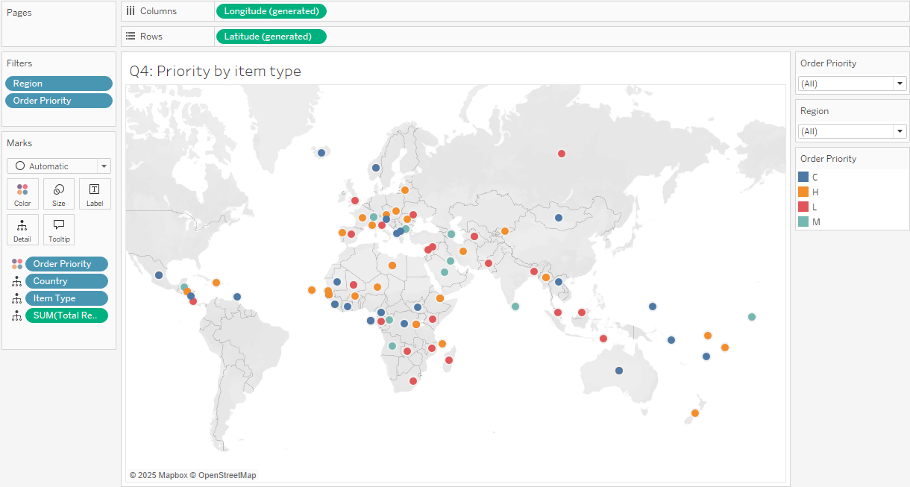
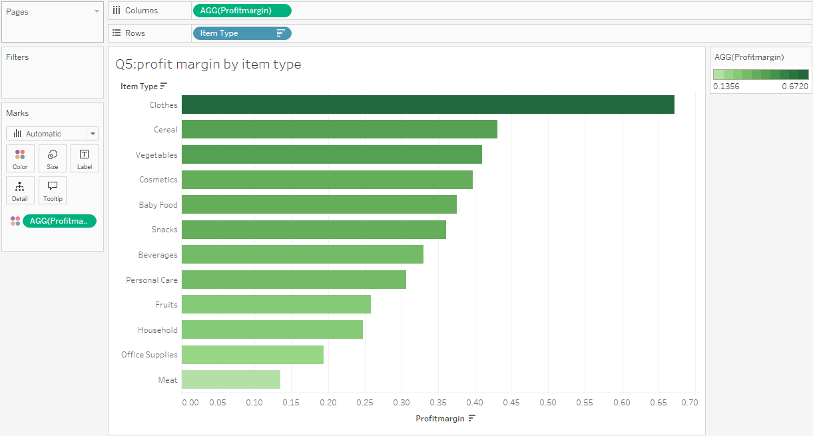
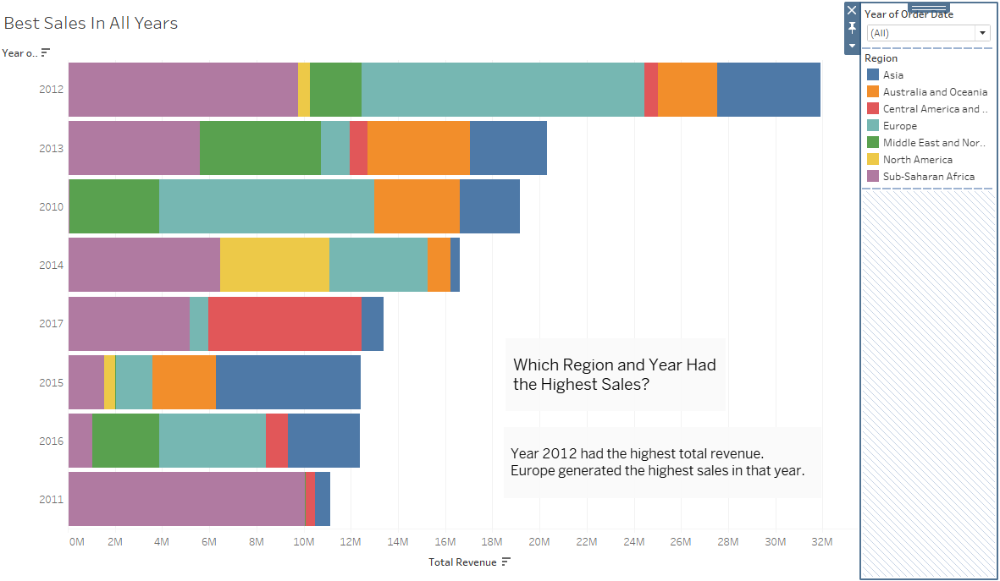
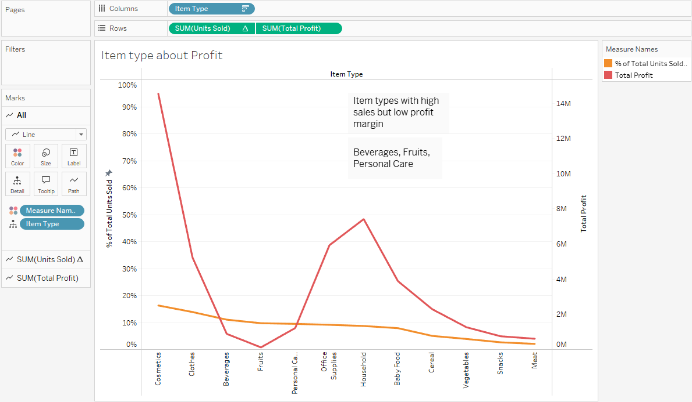
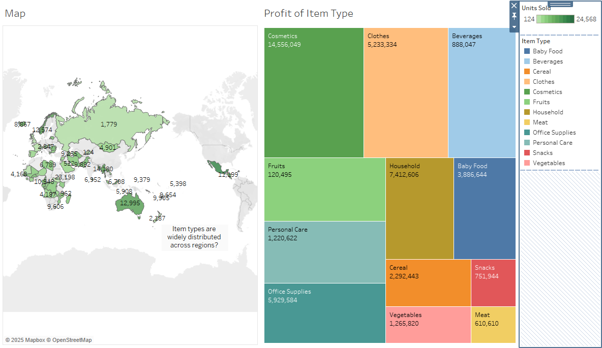

# CP372-RM_SM_TS

## Amazon Sales Data
This dataset contains **100 rows of Amazon sales data** from **2010 to 2017**, including information such as region, country, item type, sales channel, order priority, order date, order ID, ship date, units sold, unit price, unit cost, total revenue, total cost, and total profit.

## About Dataset
- **Region**: The broad geographical region of the sale (e.g., "Europe", "Sub-Saharan Africa").
- **Country**: The specific country within the region where the sale occurred.
- **Item Type**: The category of the product sold (e.g., "Baby Food", "Office Supplies").
- **Sales Channel**: The method of sale, either "Online" or "Offline".
- **Order Priority**: The priority level assigned to the order (e.g., "H", "C", "L").
- **Order Date**: The date the order was placed.
- **Order ID**: A unique identifier for the order.
- **Ship Date**: The date the order was shipped.
- **Units Sold**: The quantity of the product sold.
- **Unit Price**: The selling price per unit of the product.
- **Unit Cost**: The cost price per unit of the product.
- **Total Revenue**: The total revenue generated from the sale (Units Sold * Unit Price).
- **Total Cost**: The total cost incurred for the sale (Units Sold * Unit Cost).
- **Total Profit**: The total profit made from the sale (Total Revenue - Total Cost).
- **Profit Margin**: A new feature showing the ratio of profit to revenue.
  
  ## Data Preparation
Data cleaning was performed using [Google Colaboratory](https://colab.research.google.com/drive/17uaQqiXCXsSVC84Y_GjDLplYLZGX33tu#scrollTo=ZOIEzSzvfRo8).  
- No missing or duplicate values were found  
- Dataset is ready for exploratory and in-depth analysis

## Exploratory Data Analysis
Exploratory Data was performed using [Tableau Public](https://public.tableau.com/views/Project_Amazon_Sales_Data/BestSalesbyRegionandYear?:language=en-US&publish=yes&:sid=&:redirect=auth&:display_count=n&:origin=viz_share_link
).

### Total Revenue by Year
> **Insight**: 2012 had the **highest** revenue and 2011 the **lowest**

### Profit by Region
> **Insight**:  
- **Top-performing**: Sub-Saharan Africa  
- **Low-performing**: North America

### Product Sales by Region 
> **Insight**: Tree Map displays sales performance per region and product category

### Order Priority by Item Type 
> **Insight**: Distribution of order priority levels by product category and country, with colors representing C (Critical), H (High), M (Medium), and L (Low)

### Profit Margin by Item Type 
> **Insight**:  
- **Highest** margin: Clothing  
- **Lowest** margin: Meat 

## In-Depth Analysis,Insights & Recommendations,Visualization
### Question 1 : Which Region and Year had the Highest Sales?

Based on the bar chart illustrating annual total revenue, 2012 recorded the highest sales, with Europe being the region with the highest revenue in that year.
The correlation analysis between year and total revenue yielded a value of -0.0371, which is close to zero, indicating **no linear relationship between the passage of time (year) and sales**. In other words, sales did not consistently increase or decrease over the years.
Therefore, the peak sales in 2012 **are unlikely due to a temporal trend**, but rather attributed to specific factors such as marketing strategies or promotional activities in Europe, as noted in the chart description.
### Recommendations 
1. **Analyze 2012 Strategies** : Identify key factors driving the peak sales, such as campaigns used in Europe, and consider adapting them for other years or regions.
2. **Focus on Controllable Factors rather than time trends** : Such as **consumer behavior**, **regional promotions**, and **sales channel optimization** instead of relying on time-based trends.
3. **Invest in High-Performing Regions** : Double down in regions like **Europe**:
   - Expand distribution channels  
   - Tailor promotions  
   - Collaborate with local partners  

### Question 2: Which Item Types “Sell Well but Generate Low Profit”?

The red line represents Total Profit, while the orange line shows % of Total Units Sold.
When the red line is below the orange line, it indicates high sales volume but relatively low profit compared to sales quantity. 
Three item types fall into this category: Beverages, Fruits and Personal Care.
Correlation analysis between the percentage of units sold and profit by item type shows a **correlation coefficient of 0.5646**, indicating a **moderate positive correlation**.
- Examples:
- This means items that sell more tend to generate more profit, but not always 100%.
- Beverages and Fruits have high sales but low profit margins.
- Household and Office Supplies have moderate sales but higher profit margins.
Therefore, while sales volume influences profit, other factors such as cost, profit per unit, and target customers should also be considered.

### Recommendations
1. **Adjust strategies for high-selling** but low-profit items like Beverages and Fruits by reducing costs or increasing profit margins per unit.

2. **Promote high-profit items** such as Household, even with lower sales, through targeted campaigns or joint promotions.

3. **Implement bundling strategies** to increase overall profit by pairing high-profit items with best-sellers.

4. **Analyze the impact of price** adjustments to make more accurate strategic decisions.

5. **Consider factors beyond sales volume**, such as costs and target markets, for sustainable product portfolio management.

### Question 3: How is the distribution of item types?

The analysis uses a map to show sales by country and a Treemap to present total profit by item type, with a color bar indicating units sold.
- **Cosmetics** have the highest profit across all item types (14.5M), despite not having the highest sales volume
→ Indicates high profit per unit or effective pricing strategy
- **Beverages**, **Fruits**, and **Personal Care** have high sales volume but relatively low profit; for example, Fruits generate only 120K profit
→ Possibly low-margin items or high costs
- **Household** and **Office Supplies** show strong profits in multiple countries
→ These categories should be prioritized for higher returns
- Countries in South Asia (e.g., India) and the Middle East have high sales
→ Highlighting key markets for product expansion
### Recommendations
1. Focus on Cosmetics and Office Supplies to increase profit
2. Adjust pricing and cost management strategies for high-volume, low-profit items like Beverages and Fruits
3. Enhance marketing efforts in high-sales countries to grow the customer base
