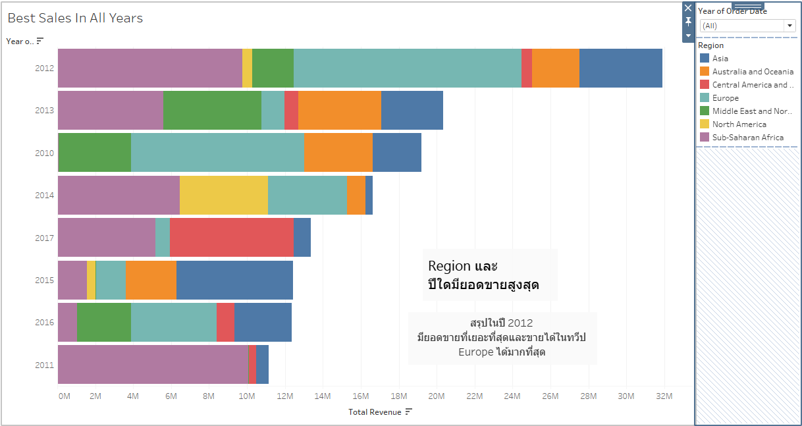
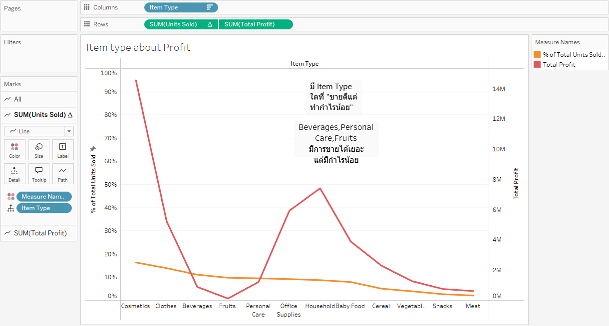

# CP372-RM_SM_TS

## Amazon Sales Data
This dataset contains 100 rows of Amazon sales data from 2010 to 2017, including information such as region, country, item type, sales channel, order priority, order date, order ID, ship date, units sold, unit price, unit cost, total revenue, total cost, and total profit.

## About Dataset
- **Region**: The broad geographical region of the sale (e.g., "Europe", "Sub-Saharan Africa").
- **Country**: The specific country within the region where the sale occurred.
- **Item Type**: The category of the product sold (e.g., "Baby Food", "Office Supplies").
- **Sales Channel**: The method of sale, either "Online" or "Offline".
- **Order Priority**: The priority level assigned to the order (e.g., "H", "C", "L").
- **Order Date**: The date the order was placed.
- **Order ID**: A unique identifier for the order.
- **Ship Date**: The date the order was shipped.
- **Units Sold**: The quantity of the product sold.
- **Unit Price**: The selling price per unit of the product.
- **Unit Cost**: The cost price per unit of the product.
- **Total Revenue**: The total revenue generated from the sale (Units Sold * Unit Price).
- **Total Cost**: The total cost incurred for the sale (Units Sold * Unit Cost).
- **Total Profit**: The total profit made from the sale (Total Revenue - Total Cost).
- **Profit Margin**: A new feature showing the ratio of profit to revenue.
  
  ## Data Preparation
[Google Colaboratory](https://colab.research.google.com/drive/17uaQqiXCXsSVC84Y_GjDLplYLZGX33tu#scrollTo=ZOIEzSzvfRo8)
Data cleaning was conducted in Google Colab to check for missing values or duplicate entries. After the inspection, no issues were found, indicating that the data is ready for further use.

## Exploratory Data Analysis
- Total Revenue by Year

- Profit by Region

- Product Sales by Region

- Priority by Item Type

- Profit margin by Item Type

 ## In-Depth Analysis,Insights & Recommendations,Visualization
- Sales best of the year by Region

- Item type about profit

- Map Profit of item type

 ## In-Depth Analysis,Insights & Recommendations,Visualization

